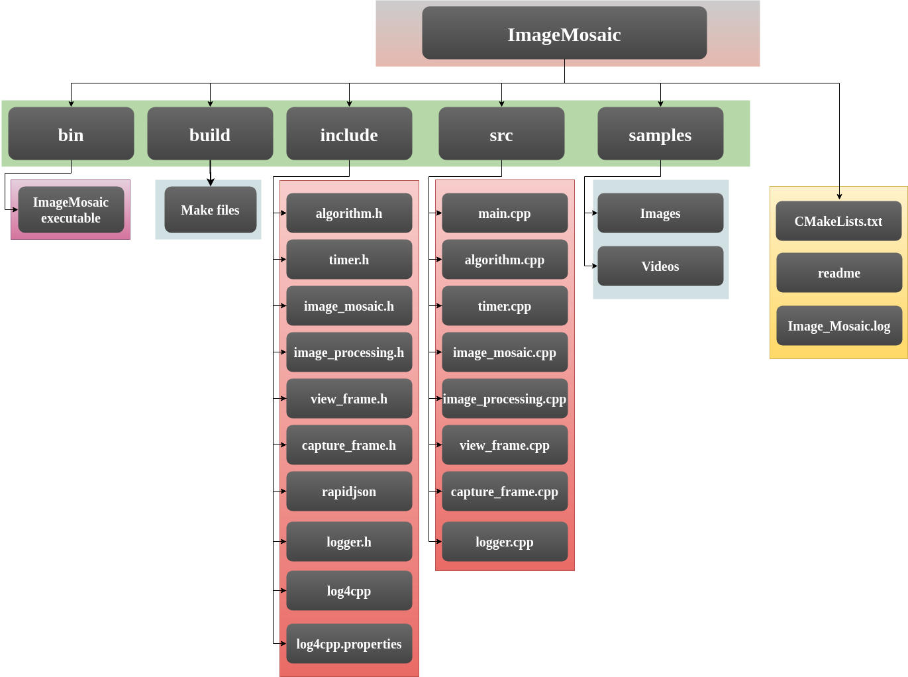
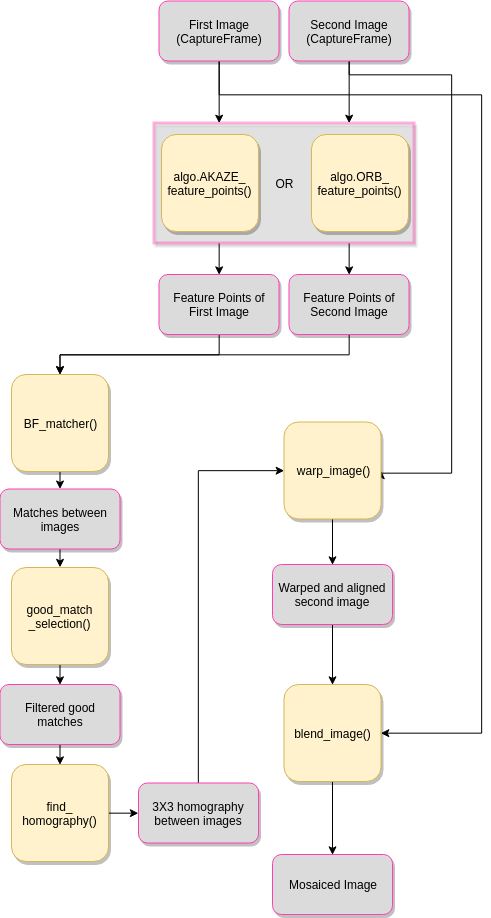
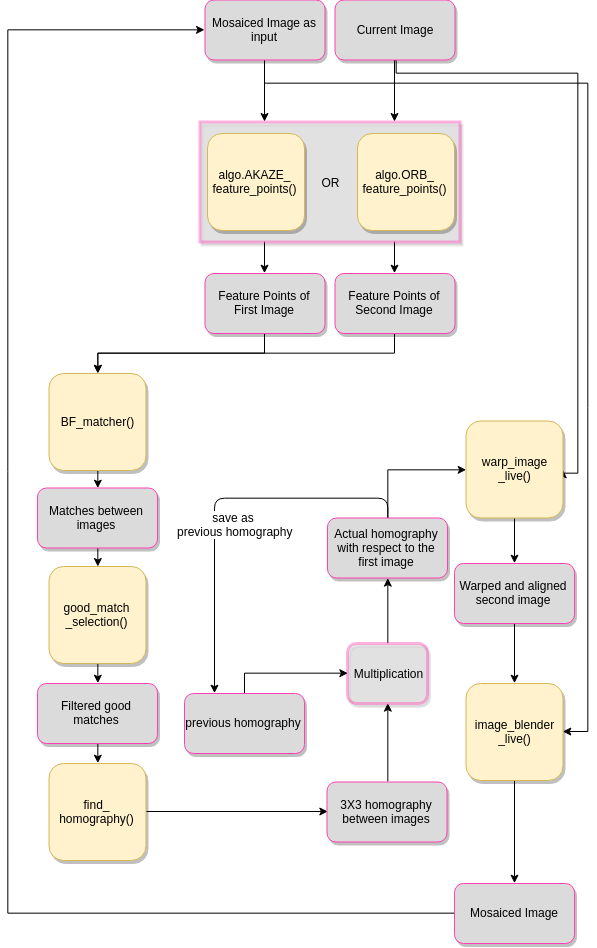

# IMAGE MOSAICING
---------------------                                
<div style="text-align: right"> Planys Technologies </div>

### Image mosaicing(or image stitching) is the method of creating a Larger picture by stitching up smaller pictures. This method provides larger field of vision without compromising on resolution of the image.


## SETIING UP
Make sure you have the following files in your system

1. main.cpp
2. image_mosaic.cpp
3. image_mosaic.h
4. image_processing.cpp
5. image_processing.h
6. view_frame.cpp
7. view_frame.h
8. capture_frame.cpp
9. capture_frame.h
10. timer.cpp
11. timer.h
12. algorithm.cpp
13. algorithm.h
14. logger.cpp  
15. logger.h
16. log4cpp.properties
17. Image_Mosaic.log (will be automatically created if not)
18. CMakeLists.txt
19. configure.json

Dependencies

1. Opencv 3.4
2. rapidjson
3. log4cpp

### File System
-------------




Now to compile, move to the main directory and run the following commands on terminal.

```
cd build
cmake ..
make
```
The code offers multiple modes of execution.
To Execute the code, change the directory to bin.
```
cd bin
```

### Configuration File

#### Program Execution
1. DebugMode : 

    "true" : Log file will be written to disk, Debug logs will be recorded.

    "false" : Log file will not be written. All logs above Debug flag will be shown in console.

2. RunnningMode : 

    "commandline" : run with arguments list in terminal.

    "GUI" : Run with information flow from GUI layer.

    "automated" : Run with Directory for enhancing every file in it.

3. ExeMode : 

    "DEV" : Developer mode. This will display every windows during execution.

    "EXE" Execution mode. This will suppress every windows displays. Output files will be written

#### General Settings
1. DefaultVideo : 

    "PathToVideo" : This video file will be used when no file are supplied by the user.

2. DefaultImage : 

    "PathToImage" : This image file will be used when no files are supplied by the user.

3. RegionOfInterest_x

    integer(0,100) : Distance to the left side of Region of interest in percentage of width.

4. RegionOfInterest_y

    integer(0,100) :  Distance to the top side of Region of interest in percentage of height.

5. RegionOfInterest_width

    integer(0,100) :  Width of Region of interest in percentage of width.

6. RegionOfInterest_height

    integer(0,100) : Height of Region of interest in percentage of height.

7. UseDehaze(CLAHE)
    
    "true"        : Dehaze will be done in all frame before attempting mosaicing.
    "false"         : Dehazing will not be used.

8. UseDehaze(CLAHE)
    
    "true"        : Same location wiht same name will be used for all the outputs.
    "false"         :Values in default output paths will be used .


#### Live Mosaic

1. CameraDelay : 

    integer(>0) : Time in micro-seconds to wait before acquiring the next next frame.
2. VideoFrameSkip : 

    integer(>0) : The number of frames to skip before acquiring the next frame.

3. DefaulIntermediateOutput : 

    file path : The default file path to write intermediate output files

4. DefaultOutput : 

    file path : The default file path to write output files

## commandline execution

1. pair mode:

    pair mode is the basic operation mode of this program. It accepts two images as arguments and stitches them together.
    ```
    ./ImageMosaic pair <path to image 1> <path to image 2>
    ```

2. image vector from images mode:

    This mode  creates an image vector from all the images passed as arguments and then stitches them all together to create a mosaic.
    ```
    ./ImageMosaic img_vec_img <path to images seperated by space>
    ```


3. image vector from video mode :
    
    Ths mode creates an image vector from a video in user specified framerate. And then stitches them together.
    ```
    ./ImageMosaic img_vec_vid <path to video>
    ```


4. live mode: 

    Live mode supports image mosaicing from from a video file or camera realtime.

    From video file
    ```
    ./ImageMosaic live <path to video>
    ```

    From camera input

    ```
    ./ImageMosaic live <camera port>
    ```


## PROGRAM ACCESSIBLE PARAMETERS

*(for the following section, 'Mosaic' is used as an object to the class ImageMosaic)

### Public Variables that can be set manually for Image Mosaic

1. Mosaic.roi\_x

   ```int``` : starting position in x-direction for region of interest.

2. Mosaic.roi\_y

   ```int``` : starting position in y-direction for region of interest.

3. Mosaic.roi\_height

   ```int``` : height of region of interest.

4. Mosaic.roi\_width

   ```int``` : width of region of interest.

5. Mosaic.use\_dehaze

    ```true``` : CLAHE contrast enhancement is applied to each frame before mosiacing for better performance. But this causes the program to be slow.
    
    ```false``` : CLAHE is not used. Minimal version.
    
6. Mosaic.mosaic\_trigger

    _whenever set to true, it automatically set itself to false_

    `true` : Mosaicing starts or pauses or continues.

7. Mosaic.reset\_mosaic

    _whenever set to true, it automatically set itself to false_

    `true` : saves the current mosaic image in disk(root directory) and restart the mosaicing with current frame as the starting image. 

8. Mosaic.stop\_mosaic

    `true` : saves the current mosaic image to disk (root directory in name "Mosaic_Image.jpg") and view the output image. Any further keypres will exit the program.

9. Mosaic.video\_frames\_skip

    `int` : input frame rate for video for live mosaicing. Decreasing this will make the process slower since it will process more frames but sudden motion in the video can be tracked.

10. Mosaic.video\_frames\_skip

    `int` : time interval between taking frames from camera. Decreasing this will make the process slower since it will process more frames but sudden motion of camera can be tracked.
    
 

### Public functions that can be used set parameters for Laser Ranging

1. Mosaic.set_roi()

    Set region of interst passing x and y coordinate of center point and width and height of the needed region of interst

    ```c++
    Mosaic.set_roi(int x, int y, int width, int height);
    ```

### Publically accessible variables for Laser Ranging

1. Mosaic.image_count

    ```int``` :  Returns the number of images got stitched in the current mosaic

2. Mosaic.mosaic\_image

    ```CaptureFrame```: The Mosaic image.


### Publically accessible functions to get data for Laser Ranging

1. Mosaic.view\_keypoints()

    Shows the feature points identified in each images.
    
2. Mosaic.view\_matches()

    Shows the good matches between the two images in consideration.
    
4. Mosaic.display\_image\_vector()

    Displays each images stored in the image vector.
    Applicable in modes where image vector is created image vector from images and video.

5. Mosaic.crop\_live()

    To crop the black part around the mosaic image and returns the cropped image.
    ```c++
    CaptureFrame cropped_image = Mosaic.crop_live();
    ```
    Only used in live mosaicing.

## Program Flow

### Basic Mosaicing



### Live Mosaicing



## INCLUDED FILES

   

## 1. image_mosaic.cpp   
            
 ### Class ImageMosaic

 Derived class of Class ImageProcessing. Have functions and variables exclusively used for Image Mosaicing.

#### Functinos

 * void view_image_keypoints()              :
    
    *show identified featurepoints in the curresponding image*              
 * void find_homography()   : 
    
    *finding 3X3 homography matrix from the identified matches*
 * void find_actual_homography()   : 
    
    *finding 3X3 homography matrix from the identified good matches*

 * void view_matches()             : 
    
    *shows the good matches identified on the images*
 * void warp_image()     : 
    
    *Funtion to warp the current image so that it aligns with the previous image*
 * void warp_image_live()     : 
    
    *Funtion to warp the current image so that it aligns with the previous image in live mosaicing*      
 
 * void image_blender()       : 
    
    *Function to blend the two images together. FeatherBlender is used with sharpness 0.09*        
 
 * void image_blender_live()       : 
    
    *Function to blend the two images together in live mosaicing. FeatherBlender is used with sharpness 0.09* 
 *   CaptureFrame crop_live()                  : 
    
      *Function to crop the black areas surrounding the mosiac image. This returns the cropped image*   
 * void image_vector_maker(int argc, char** argv)     : 
    
    *Make image vector using the original argument list passed to the main function.*
 * void image_stream_recorder(CaptureFrame video, int frame_rate)                   : 
    
    *SMake image vecotr from video in the specified framerate*   
 * int number_of_matches()       : 
    
    *Returns the number of good matches identified in two images* 

* void OpenCV_Stitcher(CaptureFrame)       : 
    
    *Stitches either the images passed or the images currently on the image vector* 
* void video_mosaic(CaptureFrame)       : 
    
    *creates image vector from video and then stitches them together* 
* void live_mosaicing_video(CaptureFrame)       : 
    
    *Execute Real time mosaicing from a video file* 

* void live_mosaicing_camera(CaptureFrame)       : 
    
    *Execute Real time mosaicing from camera * 


 ***Public Variables***
 * mosaic_trigger                  : 
        
    *start, pause, and continue mosicing in live mosaicing*
 * reset_mosaic                  : 
        
    *save the current mosaic and start new mosaic with the current frame*
 * stop_mosaic                          : 
        
    *saves the current mosic and shows it. Further keypress will exit the program*
 * image_count     : 
        
    *number of images got successfully stitched in live mosaicing mode*
 * mosaic_image                    : 
        
    *final mosaic image*
  * video_frame_skip                             : 
        
      *how many frames needed to be skipped between two consecutive frame inputs in live mosaicing from video*
 * camera_frame_delay

    *delay in acquiring next frame from camera in live mosaicing*
 * roi_x,roi_y,roi_height,roi_width                 : 
        
    *define the region of interest for image matching (However entire image will be blended)*
 
## 2. image_processing.cpp

### Class ImageProcessing

Class Imageprocessing will have the basic image processing functionalities. This class will be the parent class class for most of the other image processing classes.


**Functions**

  *  CaptureFrame roi_selection(CaptureFrame)                 :
     
     *Crop the region of interset*
  * CaptureFrame hsv_segmentation  (CaptureFrame)              : 
        
     *Segment image according to color set previously (preset for red)*
 *  void set_threshold (CaptureFrame)                : 
        
    *set color threshold according to scene or manual input*
 * void set_roi  (int x_percent,int y_percent,int width,int height)                       : 
        
   *Set region of interset*

  ***Public Variables***

 * threshold_high_0                : 
        
    *to set high value of color threshold in 0 hue range*
 * threshold_high_180              : 
        
    *to set high value of color threshold in 180 hue range*
  * threshold_low_0                 : 
        
     *to set low value of color threshold in 0 hue range*
 * threshold_low_180               : 
        
    *to set low value of color threshold in 180 hue range*
 * roi_percentage                  : 
       
    *to set required region of interest percentage*

## 3. algorithm.cpp

### Class Algorithm

Algorithm class will contain all the algorithms needed for image processing. one object of this class will be present in ImageProcessing class.

***Functions***
    
* CaptureFrame CLAHE_dehaze(CaptureFrame)                     : 
        
     *Dehaze using CLAHE algorithm*
 * CaptureFrame hist_equalize (CaptureFrame):                     : 
       
    *Dehaze using normal histogram equalization.*
* AKAZE_feature_points(CaptureFrame,CaptureFrame)
    
    *Feature point identification using AKAZE algorithm*
* ORB_feature_points(CaptureFrame,CaptureFrame)
    
    *Feature point identification using ORB algorithm*


## 4. view_frame.cpp

### Class ViewFrame

ViewFrame class is used for displaying the images. This class offers multiple modes of displaying including multiple displays(upto 4 frames) and interrupted displays(waits for user input and then continue)

***Functions***

 * void single_view_interrupted   (CaptureFrame)      : 
        
     *Show single window and wait for user input to continue*
 *  void single_view_uninterrupted (CaptureFrame)      : 
        
     *Show single window and continue*
 * void multiple_view_interrupted  (CaptureFrame,CaptureFrame,CaptureFrame,CaptureFrame)     : 
        
     *Show multiple windows and wait for user input to continue*
 * void multiple_view_uninterrupted (CaptureFrame,CaptureFrame,CaptureFrame,CaptureFrame)    : 
        
    *Show multiple windows and continue*
 * CaptureFrame add_overlay_percent (CaptureFrame input, x_percent,y_percent,data)            : 
        
   *Add overlays to the image at a point according to percentage*
 * CaptureFrame add_overlay (CaptureFrame,x_point , y_point, data)                    : 
        
    *Add overlays to the image at the specified point*

 * CaptureFrame join_image_horizontal (CaptureFrame image1,CaptureFrame image2)                    : 
        
    *Takes two images and join them horizontlly to one single bigger image. Used in every multiple output functions*

 * CaptureFrame add_overlay (CaptureFrame image1,CaptureFrame image2)                  : 
        
    *Takes two images and join them vertically to one single bigger image. Used in every multiple output functions*
        
## 5. capture_frame.cpp

### Class CaptureFrame

CaptureFrame class is used as a substitute for image and video files. It holds one image and one video file and associated functions to load,manipulate,retrieve them.

 **Functions**

  * void capture_image (filename,window_name)                  : 
        
    *load image*
 * void capture_video     (filename,window_name)               : 
    
    *load video*

 * void reload_image        (image,window_name)             : 
    
    *rewrite existing image*

 * void reload_video       (video,window_name)             : 
    
    *rewrite existing video*

 * CaptureFrame retrieve_image                  : 
    
    *extract stored image*
 *  CaptureFrame retrieve_video                  : 
    
     *extract stored video*
 * void frame_extraction                : 
    
   *extract frame from video and store it in  image*
    . clear                           : 
    
    *clear all the data in the object
        
## 6. **timer.cpp**    

### Class Timer

Timer class is used for measuring the execution time and maximum fps. It calculates the time between timer initialising and timer ending.


 ***Functions***

 * timer_init ()                     : 
        
     *start the timer*
 * timer_end                ()       : 
        
     *end the timer and calculate execution time and maximum fps*
 * CaptureFrame add_time ()                       :    
       
     *add execution timer as overlay to image*
 * CaptureFrame add_fps   ()                      : 
    
     *add maximum fps as overlay to image*

 ***Public Variables***

 *    execution_time                  : 
    
         *to extract the execution time data*

 * fps  :

     *to extract the maximum fps data*
        

## 6. **logger.cpp**    

### Class Logger

Logger class is used for logging the state of the program during execution. A local log file named "Laser_Ranging.log" will be updated during the execution with time stamp and messages. Only logs which have equal and higher priority than WARN will shown in console. Every logs(all priorities) are written in log file.


 ***Functions***

 * void log_error (message)                     : 
        
     *record a log in error priority.*

 * void log_warn (message)      : 
        
     *record a log in warning priority.*

 * void log_info (message)                         :    
       
     *record a log in info priority.*

 * void log_debug (message)                        : 
    
     *record a log in debug priority.*

 * void logger_initialize()                        : 
    
     *initialize logger and link it to the local file. A file called log4cpp.properties are used for this purpose. it also determins the layout of recording log*


## Program Execution Time

Program's execution times are very important in terms of scalability and reliability. 

### System - 1
     CPU   - Intel i7 5th Generation octa core
     RAM  - 16 GB
    Ubuntu 16.04

| Tasks                 |   Time Taken  (ms)                    |
| -------               | ----------                            |
| Feature Detection (AKAZE)       |   1010.71                                |
| Dehazing (optional)   |   57.37 (CLAHE)  |
| Brute Force Matcher     |   1.07                               |
| Find homography |   0.4341                               |
| Good match filtering           |   0.175                                |
| Warping images               |   624.09                               |
| Blending images               |   634.03                              |
|             |                                 |
| Overall               |   2361.11                         |


(NOTE : THE TIME TAKEN FOR AKAZE FEATURE POINT IDENTIFICATION AND BRUTE FORCE MATCHER WILL DEPEND ON THE NUMBER OF FEATURES IDENTIFIED IN THE SCENE. AS THE NUMBER OF FEATURES INCREASES, THE TIME TAKEN ALSO INCREASES. HOWEVER CLAHE, WARPING AND BLENDING ONLY DEPENDS ON THE SIZE AND RESOLUTION OF THE IMAGES. THE REST HAS NO DEPENDANCIES)